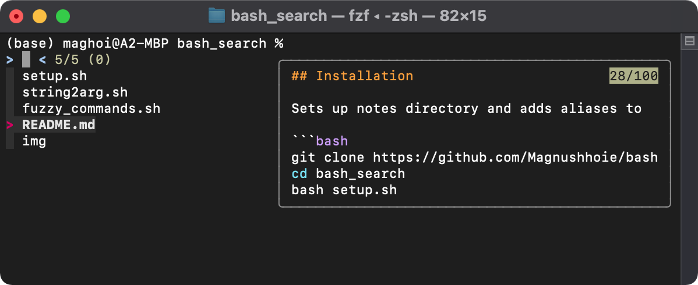

<!-- PROJECT SHIELDS -->
[![Contributors][contributors-shield]][contributors-url]
[![Forks][forks-shield]][forks-url]
[![Stargazers][stars-shield]][stars-url]
[![Issues][issues-shield]][issues-url]
[![MIT License][license-shield]][license-url]

<!-- PROJECT LOGO -->
<br />
<p align="center">
  <a href="https://github.com/Magnushhoie/bash_search">
  </a>

  <h3 align="center">bash_search</h3>

  <p align="center">
    Blazingly fast and interactive file search scripts, based on FZF and BASH.
  <br>
    Sourced from https://github.com/junegunn/fzf/wiki/examples
    
  
  </p>
</p>

<p align="center">
<a href="https://asciinema.org/a/458105">

</p>

## Installation

Sets up notes directory and adds aliases to ~/.bash_profile or ~/.zshrc.

```bash
git clone https://github.com/Magnushhoie/bash_search
cd bash_search
bash setup.sh
```

## Documentation
Commands are primarily sourced from https://github.com/junegunn/fzf/wiki/examples, with minor modifications.

```bash
$ f_help

FZF terminal shortcuts:
Control + R search bash history
Control + T search files
Escape + C jump to folder

function f_help ()    # Show list of commands
function f_open()     # Open the selected file. Hotkeys CTRL+O (open) or CTRL+E ($EDITOR)
function f_search ()  # Search all lines in all files, recursively
function f_file ()    # Find in file, preview contents
function f_folder ()  # Search folder names and cd
function f_view ()    # View files in folder, preview content and open in vim
function f_size ()    # Show cumulative file size for each file extension in folder, n-levels (default 4) deep
function f_hist ()    # Search BASH History: Fuzzy search bash history
function f_cd ()      # Interactive cd with fzf
function f_git_log () # Interactive git log (AWESOME)
function f_git_branch() # checkout git branch/tag, with a preview showing the commits between the tag/branch and HEAD
function f_kill ()    # Interactively kill process
function f_man ()     # Search bash manual
function f_pdf ()     # Search all PDFs in folder, recursively
function f_vim()      # Quick access files with fasd
function f_chrome()   # Search chrome bookmarks
```

## Requirements

Automatically installed using brew in setup.sh

```bash
brew install coreutils fd bat ripgrep rga fasd vim the_silver_searcher
```

## Compatibility
Compatible with zsh. Tested on MacOS Mojave and Ubuntu 21.04. 

## Contributing
Pull requests are welcome. For major changes, please open an issue first to discuss what you would like to change.

Please make sure to update tests as appropriate.

## License
[MIT](https://choosealicense.com/licenses/mit/)


<!-- MARKDOWN LINKS & IMAGES -->
<!-- https://www.markdownguide.org/basic-syntax/#reference-style-links -->
[contributors-shield]: https://img.shields.io/github/contributors/Magnushhoie/bash_search.svg?style=for-the-badge
[contributors-url]: https://github.com/Magnushhoie/bash_search/graphs/contributors
[forks-shield]: https://img.shields.io/github/forks/Magnushhoie/bash_search.svg?style=for-the-badge
[forks-url]: https://github.com/Magnushhoie/bash_search/network/members
[stars-shield]: https://img.shields.io/github/stars/Magnushhoie/bash_search.svg?style=for-the-badge
[stars-url]: https://github.com/Magnushhoie/bash_search/stargazers
[issues-shield]: https://img.shields.io/github/issues/Magnushhoie/bash_search.svg?style=for-the-badge
[issues-url]: https://github.com/Magnushhoie/bash_search/issues
[license-shield]: https://img.shields.io/github/license/othneildrew/Best-README-Template.svg?style=for-the-badge
[license-url]: https://github.com/Magnushhoie/bash_search/blob/master/LICENSE.txt
